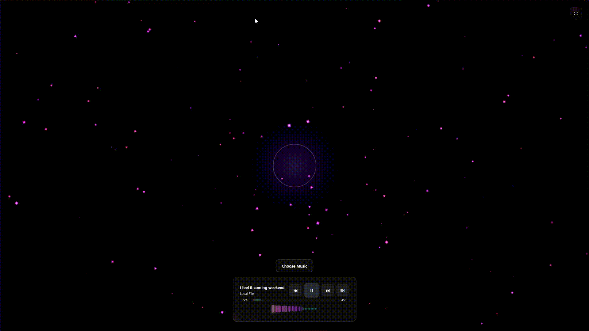

<div align="center">


# 🎵 Web Music Visualizer 🎵

### Experience your music like never before.

**A modern, immersive, and interactive web-based music visualizer that transforms your favorite tracks into a mesmerizing symphony of light and motion. Built with the pure power of the Web Audio API and HTML5 Canvas.**

[](https://opensource.org/licenses/MIT)
[](https://github.com/your-username/Web-Music-Visualizer)
[](https://github.com/your-username/Web-Music-Visualizer/graphs/commit-activity)

</div>

---

## ✨ Features

This isn't just a music player; it's an audio-visual experience.

| Feature                      | Description                                                                                             |
| ---------------------------- | ------------------------------------------------------------------------------------------------------- |
| 🎹 **Dynamic Visuals**       | Stunning particle animations with bloom effects that dance to your music's frequency and amplitude.     |
| 🎧 **Seamless Playback**     | Load and play your local audio files (MP3, WAV, etc.) with an intuitive, minimalist player interface. |
| 🚀 **Real-Time Beat Detection** | A custom algorithm detects beats in real-time, triggering explosive visual effects for emphasis.      |
| 📊 **Dual Analysis**         | See your sound with a classic frequency spectrum and a modern circular waveform, both live.             |
| 💎 **Glassmorphism UI**       | A sleek, modern user interface inspired by glassmorphism, with smooth animations and transitions.      |
| 🖥️ **Responsive & Fullscreen** | Enjoy a flawless experience on any device, or enter fullscreen mode for total immersion.              |
| ♿ **Accessibility Ready**   | Designed with ARIA labels, keyboard navigation, and `prefers-reduced-motion` support.                 |
| 🔧 **Extensible Engine**     | A modular pattern system allows developers to easily create and plug in new visualization styles.      |

---

## 🚀 Live Demo & Screenshots

See it in action! **[> Click here for the Live Demo <]**


<div align="center">
  
  <p><em>Particle bloom effect reacting to a song's chorus.</em></p>
</div>

---

## 🛠️ Tech Stack

Crafted with care using modern, native web technologies. No frameworks, no compilers, just pure performance.


---

## 📦 Getting Started

Ready to run the visualizer locally? It's as simple as 1-2-3.

1.  **Clone the Repository**
    ```sh
    git clone https://github.com/Joker-pyc/Web-Music-Visualizer.git
    cd Web-Music-Visualizer
    ```

2.  **Open the File**
    -   Simply drag `index.html` into your favorite browser window.
    -   **Pro Tip:** For the best experience, use a local server. If you have VS Code, we recommend the [Live Server](https://marketplace.visualstudio.com/items?itemName=ritwickdey.LiveServer) extension.

3.  **Enjoy!**
    -   Click **Choose Music**, pick a track, and watch the magic happen.

---

## 🎮 How to Use

| Control         | Action                                                                                             |
| --------------- | -------------------------------------------------------------------------------------------------- |
| **Choose Music**  | Click the main button to open your file browser and select an audio track.                         |
| **Play / Pause**  | Click the ▶️/⏸️ button in the center of the control bar or press the **`Spacebar`**.             |
| **Seek**          | Click and drag along the progress bar or use the **`Left/Right Arrow Keys`** to skip.            |
| **Volume**        | Click the 🔊 icon to open the volume slider.                                                       |
| **Fullscreen**    | Click the ⛶ icon to enter or exit a fully immersive view.                                          |

---

## 🎨 Customization

Want to make it your own? The project is designed to be easily extensible.

-   **🎨 New Visual Patterns:** Create a new `.js` file in the `/patterns` directory. Follow the structure of `pattern0.js` to define your own unique animation logic. The system will pick it up automatically!
-   **💅 CSS Styling:** All colors, glass effects, and layouts are defined in `style.css`. Tweak the CSS variables at the top of the file to quickly change the entire color scheme.
-   **⚙️ Core Logic:** The main application logic resides in `script.js`. Feel free to modify the beat detection algorithm, add new UI elements, or integrate new features.

---

## 🤝 Contributing

Contributions, issues, and feature requests are welcome! Feel free to check the [issues page](https://github.com/your-username/Web-Music-Visualizer/issues).

1.  Fork the Project
2.  Create your Feature Branch (`git checkout -b feature/AmazingFeature`)
3.  Commit your Changes (`git commit -m 'Add some AmazingFeature'`)
4.  Push to the Branch (`git push origin feature/AmazingFeature`)
5.  Open a Pull Request

---

## 📜 License

This project is distributed under the **MIT License**. See `LICENSE` for more information.

> **© 2025 Santosh Maurya** - Feel free to use, modify, and distribute for personal or commercial purposes. Attribution is appreciated.

---

<div align="center">
  <h3>Show your support by giving this project a ⭐!</h3>
</div>